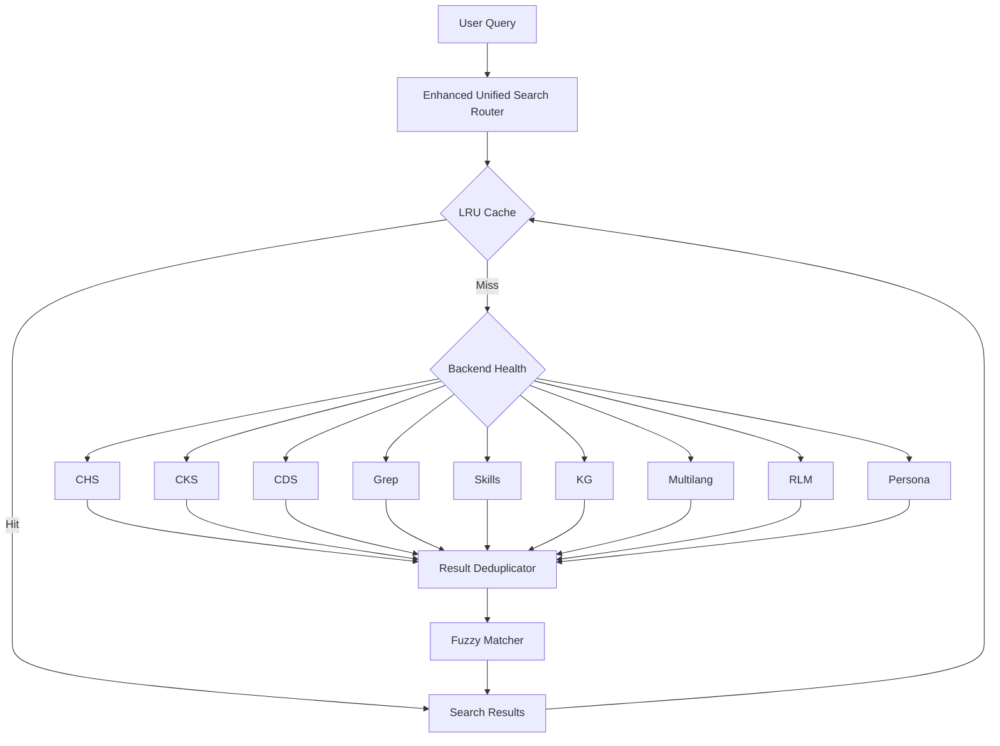

# unified-search

> Unified search and knowledge system for AI coding environments - combining 9+ specialized backends with hybrid scoring, intelligent caching, and automatic health tracking

[](https://github.com/csf-nip/unified-search/actions) [](https://pypi.org/project/unified-search/) [](https://pypi.org/project/unified-search/) [](https://opensource.org/licenses/MIT)

## Features

- **Multi-Backend Search**: 9+ specialized backends (code, knowledge, chat history, skills, and more)
- **Hybrid Scoring**: BM25 + cosine similarity fusion for relevance ranking
- **Query Caching**: LRU cache with TTL for fast repeated queries
- **Backend Health**: Automatic health tracking with exponential backoff
- **Fuzzy Matching**: Typo tolerance for misspelled queries
- **Result Deduplication**: Cross-backend duplicate removal
- **Streaming Results**: Async parallel execution for responsive search
- **Flexible Configuration**: Environment variable and code-based configuration

## Installation

### Basic Installation (Core Backends)

```bash
# Install from PyPI (when published)
pip install unified-search

# Install from local source
pip install packages/unified-search/
```

Includes core backends: CDS (Code Documentation), Grep (Code Patterns), Skills

### Full Installation (All Features)

```bash
# Install with all optional dependencies
pip install unified-search[all]

# Or install specific feature sets
pip install unified-search[chs,cks]    # Chat History + Constitutional Knowledge
pip install unified-search[multilang]  # Multi-language code search
pip install unified-search[ml]         # Machine learning features
pip install unified-search[graph]      # Knowledge graph features
```

### Development Installation

```bash
# Editable install with dev dependencies
pip install -e "packages/unified-search[all,dev]"

# This installs:
# - All backends (chs, cks, multilang, ml, graph)
# - Dev tools (pytest, black, ruff, mypy)
# - Enables live code editing without reinstall
```

### Optional Dependencies

| Feature | Dependencies | Description |
|---------|-------------|-------------|
| **CHS** | `sentence-transformers` | Chat History Search - semantic conversation search |
| **CKS** | `faiss-cpu`, `sentence-transformers`, `numpy` | Constitutional Knowledge System - vector knowledge base |
| **Multilang** | `tree-sitter`, language parsers | Multi-language code search via tree-sitter |
| **ML** | `scipy`, `scikit-learn` | Machine learning features and advanced scoring |
| **Graph** | `networkx` | Knowledge graph and relationship analysis |

## Quick Start

### CLI Usage

```bash
# Basic search across all backends
unified-search "async patterns"

# Filter to specific backends
unified-search "vector embeddings" --backend chs cks

# Limit results
unified-search "authentication" --limit 20

# JSON output for scripting
unified-search "test query" --format json

# Show cache and health statistics
unified-search --stats

# Time-based filtering
unified-search "recent changes" --time week
```

### Python API

```python
from unified_search import search

# Simple search
results = search("async patterns")

# Filtered search with parameters
results = search(
    "vector embeddings",
    backend=["chs", "cks"],
    limit=50,
    time_filter="week"
)

# Access results
for result in results.hits:
    print(f"[{result.backend}] {result.title}")
    print(f"  Score: {result.score:.3f}")
    print(f"  {result.snippet}")
```

### Advanced Usage

```python
from unified_search import EnhancedUnifiedSearchRouter

# Create router with custom configuration
router = EnhancedUnifiedSearchRouter(
    enable_cache=True,
    cache_ttl=3600,
    enable_fuzzy=True,
    fuzzy_max_edits=2
)

# Search with full control
results = router.search(
    query="machine learning pipelines",
    backends=["CHS", "CKS", "CDS"],
    limit=20,
    threshold=0.5
)

# Access metadata
print(f"Query: {results.query}")
print(f"Total hits: {len(results.hits)}")
print(f"Backends used: {results.metadata.get('backends', [])}")
```

## Backends

| Backend | Description | Optional Dependencies | Use Case |
|---------|-------------|---------------------|----------|
| **CDS** | Code Documentation Search | None | Search docstrings and code comments |
| **Grep** | Code Pattern Search | None | Find functions, classes, patterns |
| **Skills** | Skills & Commands | None | Search progressive disclosure commands |
| **CHS** | Chat History Search | sentence-transformers | Semantic search in conversations |
| **CKS** | Constitutional Knowledge System | faiss-cpu, sentence-transformers | Vector knowledge base search |
| **KG** | Knowledge Graph | None | Entity-based conversation search |
| **MultiLang** | Multi-language Code Search | tree-sitter | Cross-language code patterns |
| **RLM** | Recursive Language Model | None | Code generation search |
| **Persona** | Persona Memory | None | Cognitive context search |

### Backend Constants

When specifying backends, use these exact names:

| CLI Input | Backend Constant |
|-----------|------------------|
| `grep` | `BACKEND_GREP = "Grep"` |
| `cds` | `BACKEND_CDS = "CDS"` |
| `chs` | `BACKEND_CHS = "CHS"` |
| `cks` | `BACKEND_CKS = "CKS"` |
| `kg` | `BACKEND_KG = "KG"` |
| `skills` | `BACKEND_SKILLS = "Skills"` |
| `multilang` | `BACKEND_MULTILANG = "MultiLang"` |
| `rlm` | `BACKEND_RLM = "RLM"` |
| `persona` | `BACKEND_PERSONA = "Persona"` |

## Configuration

### Environment Variables

| Variable | Default | Description |
|----------|---------|-------------|
| `SEARCH_KNOWLEDGE_CHS_DB` | `~/.unified-search/chat_history.db` | Path to CHS SQLite database |
| `SEARCH_KNOWLEDGE_CKS_DB` | `~/.unified-search/cks.db` | Path to CKS SQLite database |
| `SEARCH_KNOWLEDGE_CHS_JSONL_DIR` | `~/.unified-search/jsonl/` | Path to CHS JSONL directory |
| `SEARCH_KNOWLEDGE_CACHE_TTL` | `3600` | Cache time-to-live in seconds |
| `SEARCH_KNOWLEDGE_CACHE_SIZE` | `1000` | Maximum cache entries |
| `SEARCH_KNOWLEDGE_FUZZY_MAX_EDITS` | `2` | Maximum edit distance for fuzzy matching |
| `SEARCH_KNOWLEDGE_HEALTH_CHECK_INTERVAL` | `300` | Health check interval in seconds |
| `SEARCH_USE_MULTILANG` | `0` | Enable tree-sitter multi-language backend (slow on large codebases) |

### Python Configuration

```python
from unified_search import EnhancedUnifiedSearchRouter
import os

# Configure via environment variables
os.environ['SEARCH_KNOWLEDGE_CACHE_TTL'] = '7200'

# Or configure directly
router = EnhancedUnifiedSearchRouter(
    enable_cache=True,
    cache_ttl=7200,
    cache_size=2000,
    enable_fuzzy=True,
    fuzzy_max_edits=3,
    enable_health=True,
    health_check_interval=600
)
```

## Architecture

### System Overview



### Core Components

| Component | Purpose | Location |
|-----------|---------|----------|
| `EnhancedUnifiedSearchRouter` | Main orchestrator for parallel search | `router.py` |
| `LRUCache` | Query result caching with TTL | `cache.py` |
| `BackendHealthTracker` | Health tracking with exponential backoff | `backend_health.py` |
| `QueryIntentDetector` | Query intent classification | `query_intent.py` |
| `IntentClassifier` | ML-based intent recognition | `intent_classifier.py` |

### Data Flow

1. **Query Submission**: User submits query via CLI or Python API
2. **Cache Check**: Router checks LRU cache for previous results
3. **Health Check**: Backends checked for health/status
4. **Parallel Search**: Healthy backends searched in parallel
5. **Deduplication**: Cross-backend duplicates removed
6. **Fuzzy Matching**: Typo-tolerant alternative matches
7. **Result Ranking**: Hybrid scoring (BM25 + cosine)
8. **Cache Update**: Results cached for future queries
9. **Response**: Ranked results returned to user

## Documentation

| Document | Description |
|----------|-------------|
| [ARCHITECTURE.md](ARCHITECTURE.md) | System architecture, data models, and design patterns |
| [docs/api_reference.md](docs/api_reference.md) | Complete API documentation for all modules |
| [CONTRIBUTING.md](CONTRIBUTING.md) | Development guidelines and contribution process |
| [CHANGELOG.md](CHANGELOG.md) | Version history and changes |

## Examples

### Basic Search

```python
from unified_search import search

# Find code patterns
results = search("async def")
for hit in results.hits:
    print(f"{hit.backend}: {hit.title}")
```

### Filtered Search

```python
# Search only knowledge backends
results = search("machine learning", backend=["CHS", "CKS"])

# Search only code backends
results = search("authentication", backend=["CDS", "Grep"])
```

### Time-Filtered Search

```python
# Recent changes only
results = search("refactor", time_filter="week")
```

### Custom Configuration

```python
from unified_search import EnhancedUnifiedSearchRouter

router = EnhancedUnifiedSearchRouter(
    enable_cache=True,
    cache_ttl=7200,
    enable_fuzzy=True,
    fuzzy_max_edits=2
)

results = router.search("vector database", limit=20)
```

### Working with Results

```python
results = search("distributed systems")

# Access metadata
print(f"Query: {results.query}")
print(f"Total hits: {len(results.hits)}")

# Iterate results
for hit in results.hits:
    print(f"\n[{hit.backend}] {hit.title}")
    print(f"  Score: {hit.score:.3f}")
    print(f"  Snippet: {hit.snippet[:100]}...")

# Access custom metadata
if hit.metadata:
    print(f"  File: {hit.metadata.get('file', 'N/A')}")
    print(f"  Line: {hit.metadata.get('line', 'N/A')}")
```

## Development

### Setup Development Environment

```bash
cd packages/unified-search

# Create virtual environment
python -m venv venv
venv\Scripts\activate  # Windows
source venv/bin/activate  # Linux/Mac

# Install with dev dependencies
pip install -e ".[all,dev]"
```

### Running Tests

```bash
# Run all tests
pytest

# Run with coverage
pytest --cov=unified_search --cov-report=term-missing

# Run specific test file
pytest tests/test_cache.py -v

# Run with verbose output
pytest -v
```

### Code Quality

```bash
# Format code
black src/ tests/

# Lint code
ruff check src/ tests/

# Type checking
mypy src/
```

### Project Structure

```
unified-search/
├── src/unified_search/
│   ├── __init__.py           # Package exports
│   ├── router.py             # Enhanced unified search router
│   ├── cache.py              # LRU cache with TTL
│   ├── backend_health.py     # Backend health tracking
│   ├── query_intent.py       # Query intent detection
│   ├── intent_classifier.py  # ML-based intent classification
│   └── knowledge/
│       ├── __init__.py
│       └── chs/
│           ├── __init__.py
│           └── embeddings.py # CHS embedding utilities
├── tests/                    # Test suite
│   ├── test_init.py
│   ├── test_cache.py
│   ├── test_backend_health.py
│   ├── test_intent_classifier.py
│   └── test_embeddings.py
├── docs/                     # Documentation
│   └── api_reference.md
├── skill/                    # Claude Code skill
│   └── SKILL.md
├── pyproject.toml            # Project configuration
├── README.md                 # This file
└── LICENSE                   # MIT License
```

## Troubleshooting

### Common Issues

**Issue: "Backend not found" error**
- **Cause**: Optional dependencies not installed
- **Fix**: Install required dependencies
  ```bash
  pip install unified-search[chs]   # For CHS backend
  pip install unified-search[cks]   # For CKS backend
  ```

**Issue: "Database file not found"**
- **Cause**: CHS/CKS database path not configured
- **Fix**: Set environment variables
  ```bash
  export SEARCH_KNOWLEDGE_CHS_DB=/path/to/chat_history.db
  export SEARCH_KNOWLEDGE_CKS_DB=/path/to/cks.db
  ```

**Issue: "MultiLang backend slow"**
- **Cause**: Tree-sitter indexing on large codebases
- **Fix**: Disable MultiLang or use smaller codebase
  ```bash
  export SEARCH_USE_MULTILANG=0
  ```

**Issue: "Cache not working"**
- **Cause**: Cache disabled or misconfigured
- **Fix**: Enable cache in router configuration
  ```python
  router = EnhancedUnifiedSearchRouter(enable_cache=True)
  ```

### Debug Mode

Enable verbose logging for troubleshooting:

```bash
# Set environment variable
export SEARCH_KNOWLEDGE_DEBUG=true
export SEARCH_KNOWLEDGE_LOG_LEVEL=DEBUG

# Or in Python
import logging
logging.basicConfig(level=logging.DEBUG)
```

### Getting Help

- **Documentation**: See [docs/api_reference.md](docs/api_reference.md) for API details
- **Issues**: Report bugs at https://github.com/csf-nip/unified-search/issues
- **Contributing**: See [CONTRIBUTING.md](CONTRIBUTING.md) for guidelines

## Performance Tips

1. **Enable Caching**: Cache repeated queries for faster results
   ```python
   router = EnhancedUnifiedSearchRouter(enable_cache=True)
   ```

2. **Limit Backends**: Search only relevant backends
   ```python
   results = search("query", backend=["CDS", "Grep"])
   ```

3. **Set Limits**: Restrict result count for faster responses
   ```python
   results = search("query", limit=20)
   ```

4. **Disable Multilang**: Use AST backends (CDS/Grep) instead of tree-sitter
   ```bash
   export SEARCH_USE_MULTILANG=0
   ```

## License

MIT License - see [LICENSE](LICENSE) for details.

## Contributing

Contributions are welcome! Please see [CONTRIBUTING.md](CONTRIBUTING.md) for guidelines.

## Version

0.1.0 (Alpha)

## Links

- **Homepage**: https://github.com/csf-nip/unified-search
- **Documentation**: https://unified-search.readthedocs.io
- **Repository**: https://github.com/csf-nip/unified-search
- **Issues**: https://github.com/csf-nip/unified-search/issues
## 📺 Assets & Media

Architecture diagrams are available in the [assets/](./assets/) directory:

- **Architecture Diagram**: See [assets/diagrams/architecture.md](./assets/diagrams/architecture.md) for system design overview
- **Integration Guide**: Examples for integrating with global /search command

Note: Diagrams use mermaid format and can be rendered in GitHub's markdown viewer.
