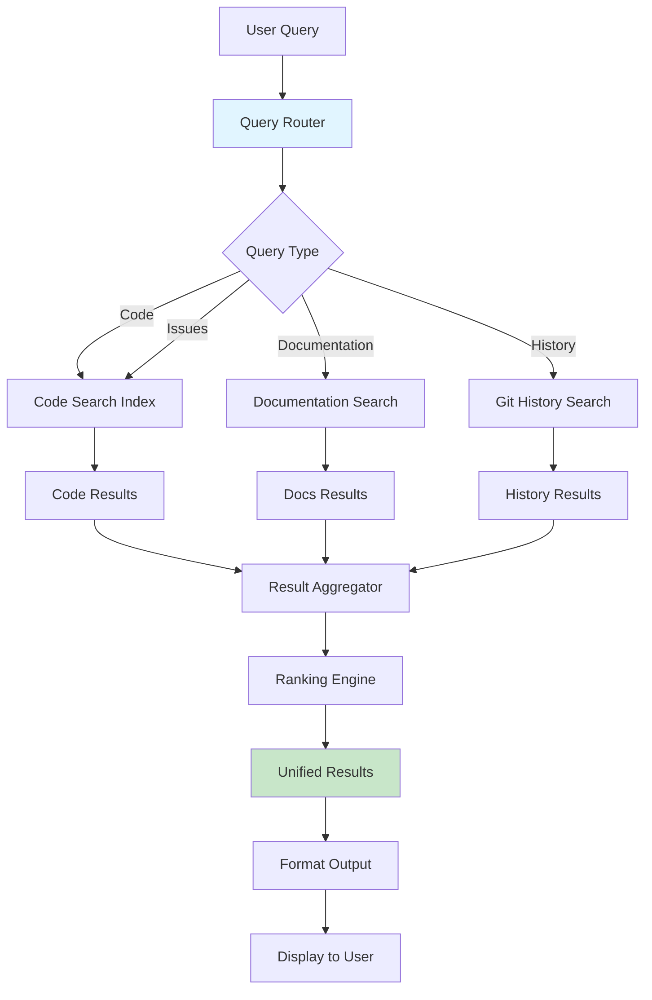

# Unified Search Architecture Diagram



## Search Backends

### Code Search
- **Ripgrep**: Fast text search via regex
- **AST Indexing**: Syntax-aware code search
- **Semantic Search**: Code understanding via embeddings

### Documentation Search
- **Markdown Docs**: README, guides, tutorials
- **Code Comments**: Inline documentation
- **API Docs**: Sphinx, Javadoc, etc.

### History Search
- **Git Log**: Commit messages and diffs
- **Blame**: Line-by-line authorship
- **Timeline**: Temporal code evolution

## Query Processing Pipeline

```
User Input Query
    ↓
Intent Detection
    ↓
Query Routing
    ↓
Parallel Search (3 backends)
    ↓
Result Aggregation
    ↓
Ranking (relevance + recency)
    ↓
Format Output
    ↓
Display Results
```

## Ranking Algorithm

**Factors:**
1. **Text Relevance**: TF-IDF similarity
2. **Code Context**: File type, path importance
3. **Recency**: Commit timestamp, last modified
4. **Usage**: Import frequency, function calls
5. **User Feedback**: Click-through rate, acceptance

**Formula:**
```
score = (0.4 × text_relevance) +
        (0.2 × code_context) +
        (0.2 × recency) +
        (0.1 × usage) +
        (0.1 × feedback)
```

## Integration Points

- **Global Search**: `/search` command integration
- **IDE Integration**: VS Code, JetBrains
- **Git Integration**: GitHub, GitLab blame data
- **Documentation**: CKS (Constitutional Knowledge System)
- **Metrics**: Search analytics, query logs
